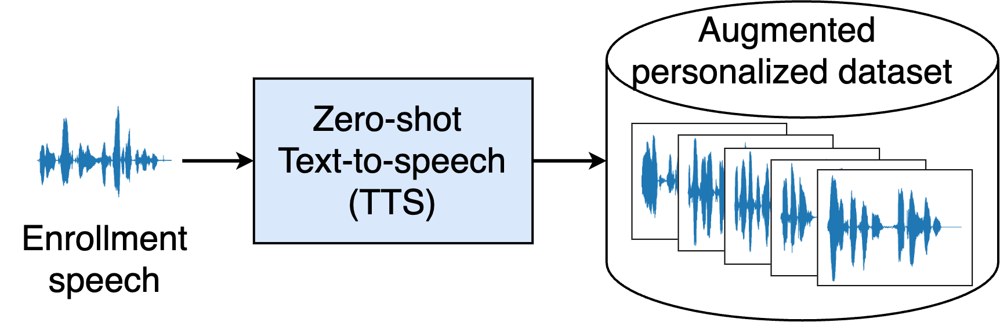
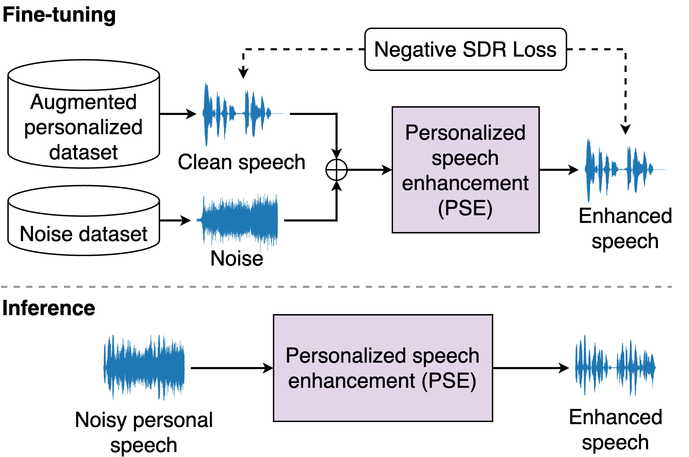

# ICASSP 2025 Generative Data Augmentation Challenge: Zero-Shot Speech Synthesis for Personalized Speech Enhancement

Official website: https://sites.google.com/view/genda2025/pse
# Introduction
This challenge calls for zero-shot text-to-speech (TTS) systems to augment speech data for the downstream task, personalized speech enhancement (PSE), as part of the [Generative Data Augmentation workshop at ICASSP 2025](https://sites.google.com/view/genda2025). In this challenge, participants are tasked first with building zero-shot TTS systems to augment personalized data. Subsequently, PSE systems are asked to be trained with this augmented personalized dataset. Through this challenge, we aim to investigate how the quality of augmented data generated by zero-shot TTS models affects PSE model performance.

**Challenge tracks:**
- Track1: Augmenting Personalized Data With Zero-shot TTS System
- Track2. Training PSE Model With Augmented Personalized Data

We also provide baseline experiments using open-source zero-shot TTS models and ConvTasNet-based PSE models to encourage participation and benchmark advancements. The implementation and training code are available [here](https://github.com/JaesungBae/GenDA-Challenge-25-ZSTTS-PSE). 

Participation is open to all. Participants are asked to participate in both tracks since our challenge aims to evaluate the effectiveness of generated speech sampled for the downstream task.

# Track details and Rules
## Track 1. Augmenting Personalized Data With Zero-shot TTS System

<div style="width=500px", align="center">
<figure>
    
    <br>
    <figcaption><em>Fig 1. Illustration of track 1.</em></figcaption>
    <br>
    <br>
</figure>
</div>


In Task 1, we aim to evaluate zero-shot TTS systems based on the signals they generate, although the main point of the challenge is to investigate their usefulness for the downstream task. At any rate the goal of the zero-shot TTS system is to generate speech samples that contain target speaker characteristics from a single enrollment utterance, to augment the personalized speech data, whose quantity tends to be limited. To evaluate the zero-shot TTS performance, we ask participants to generate speech samples with given sentences.

- We provide a single enrollment speech for 10 real-world recording speakers and 10 virtual speakers’ speech signals.
- Enrollment speech can be found in the “reference_wav” folder of each speaker [here](https://github.com/JaesungBae/GenDA-Challenge-25-ZSTTS-PSE/tree/main/data). (Enrollment speech has a sampling rate of 24 kHz.)
- Participants are asked to build a zero-shot TTS system and augment the data with provided enrollment speech of 20 target speakers.
- We provide **50 text sentences for each speaker (50 x 20 spkrs, total 1000)**, which are supposed to be used as scripts for the participating TTS system. **The corresponding speech signals are to be synthesized from the TTS system and submitted.**
- With these submitted speech signals, organizers are going to evaluate the performance of participants’ zero-shot TTS system by comparing them with the ground-truth utterances.

### Track 1 Evaluation
The zero-shot TTS system’s performance is evaluated across three aspects: speaker similarity, intelligibility, and perceptual quality.

1. Speaker similarity
    - To measure speaker similarity between the generated speech and the reference speech, we calculate the cosine distance of speaker embeddings (SECS).
    - We chose to use SpeechBrain-based speaker embedding extraction [1]  tools to calculate the SECS.
2. Intelligibility
    - To assess the intelligibility of the generated speech, we employ the open-source Whisper model [2] for speech recognition and calculate the word error rate (WER).
3. Perceptual quality
    - We adopt widely studied and increasingly adopted neural network-based MOS prediction models to evaluate the perceptual quality.
    - We are planning to use multiple MOS prediction models, the model list will be updated.

## Track 2. Training PSE Model With Augmented Personalized Data

<div style="width=500px", align="center">
<figure>
    
    <br>
    <div style="width=500px", align="center">
    <p style="width: 500px">
    <figcaption><em>Fig 2. Illustration of track 2. “Negative SDR Loss” is just one example of loss type, and participants can use any kind of loss to train the PSE model.</em></figcaption>
    </div>
    </p>
    <br>
    <br>
</figure>
</div>


In Task 2, we ask participants to build PSE models for the 20 target speakers (i.e., one PSE model tailored to work on each speaker) trained with augmented personalized data generated in Task 1. Then, we will evaluate the performance of the PSE model to measure the effectiveness of the augmented personalized dataset.

- There is no constraint on the number and length of speech signals for the augmented personalized dataset, i.e., participants can generate personalized speech signals with their zero-shot TTS system as much as they want. Hence, participants are free to use any script to synthesize speech signals.
- For the noise dataset, MUSAN’s sound-bible subset is used. We assume that the number of noise types that the target users are exposed to is limited. To this end, we assumed that **each target speaker is exposed to five different noise types.** The noise information of each speaker can be found at this [link](https://github.com/JaesungBae/GenDA-Challenge-25-ZSTTS-PSE/blob/main/data/spk_noise_set.json).
- Participants are expected to build a PSE system for each target speaker.
- Then, we provide **45 noisy test speech signals for each target speaker (45 x 20 spkrs, 900 in total)**, which is **expected to be enhanced with the participating PSE models. These denoised signals are required to be submitted.** Test speech signals can be found in the “mixed_wavs” folder of each speaker at [this link](https://github.com/JaesungBae/GenDA-Challenge-25-ZSTTS-PSE/tree/main/data). (Noisy test speech has a sampling rate of 16 kHz.)
- For a fair comparison, participants are first requested to enhance the noisy signals with baseline PSE model architecture that organizers provide, but finetuned with participants’ speech signals generated using the zero-shot TTS system developed in Task 1. This is to make sure that the evaluation and comparison are based on the quality of the synthesized data not the model architecture. 
- (Optional) In addition, participants can optionally provide results from their own model architectures. We strongly encourage participants to build light-weight PSE models in that case as one of the main benefits of personalization is about being able to reduce model size. To this end, participants are asked to explore a model architecture that is as small as possible or to investigate a range of architectures with varying complexity, **whose complexity must be reported as well (e.g., in terms of the number of parameters, FLOPS, etc).**  At any rate, it is required for participants to submit results from their versions of the provided baseline models, while the custom architecture is more like an option. 

### Track 2 evaluation.
To evaluate the performance of the PSE models and examine the effectiveness of incorporating augmented speech from zero-shot TTS systems, we will use the following four metrics commonly used in speech enhancement.

1. Signal-to-distortion ratio improvement (SDRI)
2. Signal-to-distortion ratio (SDR)
3. Extended short-time objective intelligibility (eSTOI)
4. Perceptual evaluation of speech quality (PESQ)

# Baseline systems
We also build baseline systems for each task and release it as an open-source. You can found our baseline system [here](https://github.com/JaesungBae/GenDA-Challenge-25-ZSTTS-PSE).

- For track 1, we use three open-source zero-shot TTS models as the baseline models: YourTTS [3], SpeechT5-based zero-shot TTS model [4], and XTTS [5]. 
- For track 2, we adopt the ConvTasNet [6]-based architecture for our PSE models based on the original PSE model architecture proposed in [7, 8]. 

# How to Run Baseline Experiment Code
## Track 1. Augmenting Personalized Data With Zero-shot TTS System
We provide example implementation that generate personalized speech data with [SpeechT5-based zero-shot TTS system](https://huggingface.co/microsoft/speecht5_tts).
```bash
pip install -r requirements.txt
```
```bash
python synthesize_utterances.py 
  --data_dir data
  --text_file data/synth_sentences.txt
  --output_dir {your synthesized data save dir}
```

## Track 2. Training PSE Model With Augmented Personalized Data
We provide baseline PSE implementation based on ConvTasNet architecture. We also provide the generalist (pre-trained) checkpoints with three different sizes (tiny, small, and medium), which can be found in ```checkpoints/generalists``` folder.

### Download noise dataset (MUSAN)
We used *sound-bible* subset of [MUSAN](https://www.openslr.org/17/) noise dataset. You can download MUSAN dataset as follows.
```bash
cd data
wget https://www.openslr.org/resources/17/musan.tar.gz
tar -xvzf musan.tar.gz && rm musan.tar.gz
```

### Fine-tune Generalist PSE Model
First, create csv file that contained file information for training. *In here, we only dealt with ```F0``` speaker for testing purpose.*
```bash
python create_csv_files_for_training.py 
  --wav_dir {your wav dir} 
  --csv_save_dir {your csv save dir}
```
The resulted csv file format is follows. Also, you can find an example csv file in ```examples/csv_files/speecht5_synth_50utt.csv```.
```csv
# csv file structure
{speaker name},{train/val/test},{each wav data path}\n
```

Then, change the path settings in argparser of ```train.py``` file. After that, adjust the arguments in ```examples/run_speecht5.sh``` file and train the PSE model.
```bash
bash examples/run_speecht5.sh
```

### Inference PSE model
Enhance the noisy speech using the same arguments applied to fine-tune the PSE model. Refer to the ```examples/run_speecht5.sh``` file for examples of these arguments.
```bash
python inference.py
    -s {speaker_name}
    -r {learning_rate}
    -i {model size, medium/small/tiny}
    -p {partition_name}
    --checkpoint_path {PSE checkpoint saved path}
    --test_data_csv_dir {csv saved dir}
    --save_path {enhanced speech save dir}
```


# Submission instructions
We use ICASSP 2025’s submission system on CMT.
- Login as an “Author” at [https://cmt3.research.microsoft.com/ICASSP2025/](https://cmt3.research.microsoft.com/ICASSP2025/)
- Choose “+Create new submission…” menu on the top left
- Choose the workshop “Satellite Workshop: Generative Data Augmentation for Real-World Signal Processing Applications”
- Fill out the author form and choose “Challenge: Zero-Shot TTS and Personalized Speech Enhancement” as the primary subject area
- Once **after** the submission of the two-page summary document, you will be able to see in the author console that your submission is created. On the rightmost column of your submission, you can upload the **“supplementary material”** which must contain all the zipped wave files. 
- As described in the track details, participants are expected to submit 1000 and 900 wav files for track 1 and 2, respectively.
- Please follow the directory format as below. Thank you.

```
{Team name}_task1.zip
├── F0
│   ├── F0_task1_00.wav
│   ├── F0_task1_01.wav
│   ...
│   └── F0_task1_49.wav
...
└── VirtualM4
    ├── VirtualM4_task1_00.wav
    ├── VirtualM4_task1_01.wav
    ...
    └── VirtualM4_task1_49.wav
```
```
{Team name}_task2.zip
├── F0
│   ├── F0_task2_00.wav
│   ├── F0_task2_01.wav
│   ...
│   └── F0_task2_44.wav
...
└── VirtualM4
    ├── VirtualM4_task2_00.wav
    ├── VirtualM4_task2_01.wav
    ...
    └── VirtualM4_task2_44.wav
```


# Important Dates
- **Dec. 19, 2024:** Submission system open
- **March 12, 2025:** Deadline to submit the participating system (a two-page summary and submission files)
- Challenge results will be posted on the website in early **April in 2025** (before the beginning of the conference)

# Paper Guideline
Participants are asked to submit a minimum two-page (but not exceeding four pages) summary of their system detailing the following information:
- Technical details of the TTS systems they developed
- Training data used to develop the TTS systems, including any copyright and ethics-related issues or approvals
- The description of the “zero-shot” part of their algorithm
- (Optional) Any results on the third-party evaluation data they used to validate the models
- (Optional) Description of the new PSE architecture they propose, including the model complexity


# References
- [1] M. Ravanelli, T. Parcollet, P. Plantinga, A. Rouhe, S. Cornell et al., “Speechbrain: A general-purpose speech toolkit,” CoRR, vol.abs/2106.04624, 2021. [Online]. Available: https://arxiv.org/abs/2106.04624
- [2] A. Radford, J. W. Kim, T. Xu, G. Brockman, C. Mcleavey et al., “Robust speech recognition via large-scale weak supervision,” in Proc. Int. Conf. on Machine Learning (ICLR), 2023.
- [3] E. Casanova, J. Weber, C. D. Shulby, A. C. Junior, E. G¨olge et al., “YourTTS: Towards zero-shot multi-speaker TTS and zero-shot voice conversion for everyone,” in Proc. Int. Conf. on Machine Learning (ICML), 2022.
- [4] J. Ao, R. Wang, L. Zhou, C. Wang, S. Ren et al., “SpeechT5: Unified-modal encoder-decoder pre-training for spoken language processing,” in Proc. of the 60th Annual Meeting of the Association for Computational Linguistics, 2022.
- [5] E. Casanova, K. Davis, E. G¨olge, G. G¨oknar, I. Gulea et al., “XTTS: a massively multilingual zero-shot text-to-speech model,” in Proc. Interspeech, 2024.
- [6] Y. Luo and N. Mesgarani, “Conv-TasNet: Surpassing ideal time–frequency magnitude masking for speech separation,” IEEE/ACM Transactions on Audio, Speech, and Language Processing, 2019.
- [7] A. Kuznetsova, A. Sivaraman, and M. Kim, “The potential of neural speech synthesis-based data augmentation for personalized speech enhancement,” in Proc. IEEE Int. Conf. on Acoustics, Speech and Signal Processing (ICASSP), 2023.
- [8] A. Sivaraman and M. Kim, “Efficient personalized speech enhancement through self-supervised learning,” IEEE Journal of Selected Topics in Signal Processing, 2022.

# Contacts
- Jaesung Bae (jb82@illinois.edu)
- Minje Kim (minje@illinois.edu)