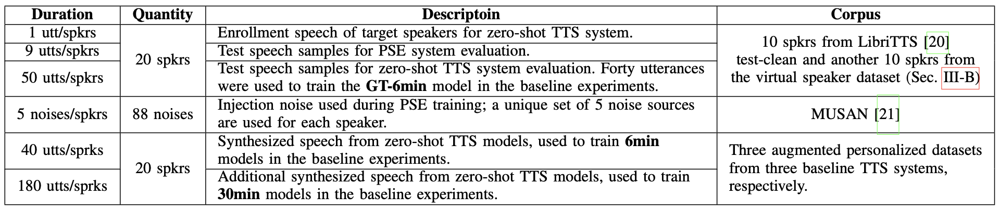

# ICASSP 2025 Generative Data Augmentation Challenge: Zero-Shot Speech Synthesis for Personalized Speech Enhancement

This challenge calls for zero-shot text-to-speech (TTS) systems to augment speech 
data for the downstream task, personalized speech enhancement (PSE), as part of 
the Generative Data Augmentation workshop at ICASSP 2025. In this challenge,
participants are tasked first with building zero-shot TTS systems to augment 
personalized data. Subsequently, PSE systems are asked to be trained with this 
augmented personalized dataset. Through this challenge, we aim to investigate how
the quality of augmented data generated by zero-shot TTS models affects PSE model
performance.

We also provide baseline experiments using open-source zero-shot TTS models and ConvTasNet-based PSE model to encourage participation and 
benchmark advancements.

- Workshop web page: [Generative Data Augmentation for Real-World Signal Processing Applications (GenDA 2025)](https://sites.google.com/view/genda2025)

- Challenge web page: [Zero-Shot TTS and PSE Challenge](https://sites.google.com/view/genda2025/pse)


## Experimental Setup
### Pre-installation
```
pip install -r requirements.txt
```

### Provided Data Summary

Summarization of provided and required to submit data is depected below. Detailed description can be found in each task section. All audio files are resampled to 16 kHz.
<div align="center">
    
</div>


## Task 1. Augmenting Personalized Data With Zero-shot TTS System
<div align="center">
    
</div>

In Task 1, we aim to build zero-shot TTS systems, which can generate speech samples that contain target speaker characteristics from a single enrollment utterance, to augment the personalized speech data. To evaluate the Zero-shot TTS performance, we asked participants to generate speech samples with given sentences. As can be found in ```data/synth_sentences.txt```, 50 sentences are asked to generate for each reference wav.

We provide additional sentences (```data/synth_sentences_additional.txt```) that are randomly selected from LJSpeech dataset. However, we do not constrain the number of sentences that participants can generate and use to train the PSE model (Task 2).

### 1.1. Data
We provide a single enrollement utterance for each speaker that is going to be used to generate personalized speech with zero-shot TTS system. We selected 10 speaker randomly from LibriTTS dataset, and additionally generated 10 virtual speakers with NN systems. Each enrollment speech can be found under ```data/{speaker_name}/reference_wav``` directory.

### 1.2. Submission
- 1000 (50 x 20 spkr) generated speech samples for each speaker with sentences in ```data/synth_sentences.txt``` to evaluate the performance of zero-shot TTS system.

#### Submission Data format
The submission format should be as follows. ```{Team name}/{speaker name}/task1/{speaker name}_task1_{000 ~ 049}.wav```.


```
{Team name}_task1.zip
├── F0
│   ├── F0_task1_00.wav
│   ├── F0_task1_01.wav
│   ├── F0_task1_02.wav
│   ...
│   └── F0_task1_49.wav
...
└── VirtualM4
    ├── VirtualM4_task1_00.wav
    ├── VirtualM4_task1_01.wav
    ├── VirtualM4_task1_02.wav
    ...
    └── VirtualM4_task1_49.wav
```
Please add a leading zero to the single-digit numbers with following codes so that we can use easily compute the results.
```python
f'{speaker_name}_task1_{i:02d}.wav'
```
### 1.3. (Optional) Run Baseline Implementation
We provide example implementation that generate personalized speech data with [SpeechT5-based zero-shot TTS system](https://huggingface.co/microsoft/speecht5_tts).
```bash
python synthesize_utterances.py 
  --data_dir data
  --text_file data/synth_sentences.txt
  --output_dir {your synthesized data save dir}
```


## Task 2. Training Personalized Speech Enhancement (PSE) Model With Augmented Personalized Data

<div align="center">
    
</div>

In Task 2, we aim to build PSE models for each speaker trained with augmented personalized data generated in Task 1. Then, we will evaluate the performance of the PSE model to measure the effectiveness of the augmented personalized dataset. 

<!-- As described in Task 1, we do not contrain the number of generated speech samples that can be used during PSE model training. -->
In here, participatns are asked to submit enhanced speech samples that are enhanced from provided nosiy test samples from each speaker with PSE model. These speech samples will be used to evaluate the PSE model performance. 

### 2.1. Data
#### 2.1.1. Speech data for PSE model training
To train the PSE model, the speech samples generated in task1 are going to be used.

#### 2.1.2. Noise data for PSE model training 
For nosie dataset, we assume that the **noise types are also personalized**; i.e., each user is assumed to be only exposed to a few types of noises. In here, we designate 5 noise samples to each speaker. The information of designated noise can be found in ```data/spk_noise_set.json```. We used *sound-bible* subset of [MUSAN](https://www.openslr.org/17/) noise dataset. You can download MUSAN dataset as follows.
```bash
cd data
wget https://www.openslr.org/resources/17/musan.tar.gz
tar -xvzf musan.tar.gz && rm musan.tar.gz
```

#### 2.1.3. Mixed speech data for PSE model evaluation
To evaluate the PSE model performance, we provide mixed speech samples for each speaker. For each speaker, we used 9 utterances for testest. Then, they are mixed with 5 different noise types with randomly selected SNR from range of {-2.5, 0, 2.5}. Therefore, the total number of mixed speech samples is 900 (45 x 20 spkrs). Mixed speech samples can be found in ```data/{speaker}/mixed_wavs``` directory. 


### 2.2. Submission
- 900 (45 x 20 spkr) enhanced speech samples from PSE model which is trained on augmented personalized speech dataset. 
#### Submission Data format
The submission format should be as follows. ```{Team name}/{speaker name}/task2/{speaker name}_task2_{000 ~ 044}.wav```.
As in task1, please add a leading zero to the single-digit numbers so that we can compute the results easily.
```
{Team name}_task2.zip
├── F0
│   ├── F0_task2_00.wav
│   ├── F0_task2_01.wav
│   ...
│   └── F0_task2_44.wav
...
└── VirtualM4
    ├── VirtualM4_task2_00.wav
    ├── VirtualM4_task2_01.wav
    ...
    └── VirtualM4_task2_44.wav
```

### 2.3. (Optional) Run Baseline Implementation
We provide baseline PSE implementation based on ConvTasNet architecture [1, 2]. We also provide the generalist (pre-trained) checkpoints with three different sizes (tiny, small, and medium).

First, create csv file that contained file information for training. In here, we only dealt with ```F0``` speaker for testing purpose.
```bash
python create_csv_files_for_training.py 
  --wav_dir {your wav dir} 
  --csv_save_dir {your csv save dir}
```
The resulted csv file format is follows. Also, you can find an example csv file in ```examples/csv_files/speecht5_synth_50utt.csv```.
```csv
# csv file structure
{speaker name},{train/val/test},{each wav data path}\n
```


Then, change the path settings in argparser of ```train.py``` file. After that, adjust the arguments in ```examples/run_speecht5.sh``` file and train the PSE model.
```bash
bash examples/run_speecht5.sh
```

## Reference
[1]  A. Sivaraman and M. Kim, “Efficient personalized speech enhancement
through self-supervised learning,” *IEEE Journal of Selected Topics in
Signal Processing*, 2022.

[2] A. Kuznetsova, A. Sivaraman, and M. Kim, “The potential of neural
speech synthesis-based data augmentation for personalized speech en-
hancement,” in *Proc. IEEE Int. Conf. on Acoustics, Speech and Signal
Processing (ICASSP)*, 2023.


## Citation
If you use our code for other projects, plese cite the following paper. Thank you.
```
Bibtex TBU
```